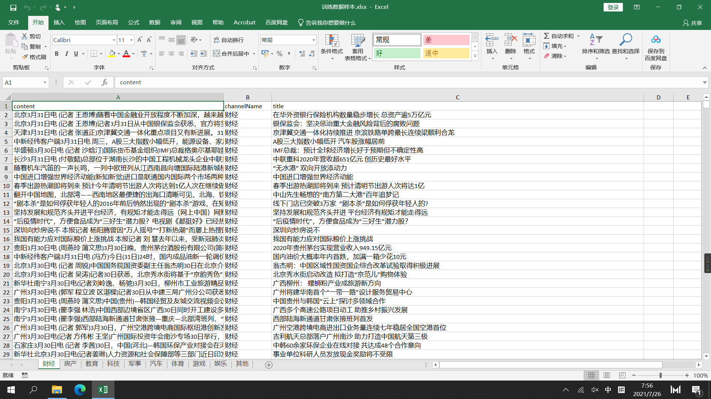
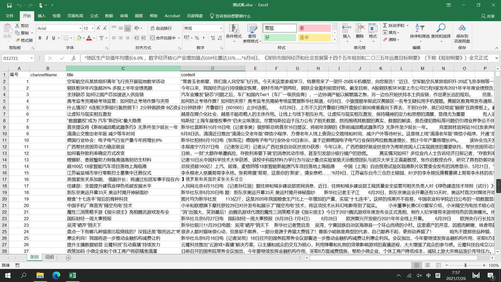
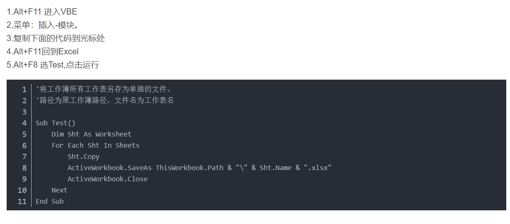
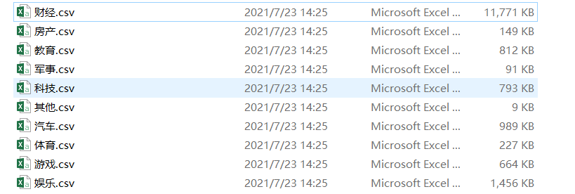
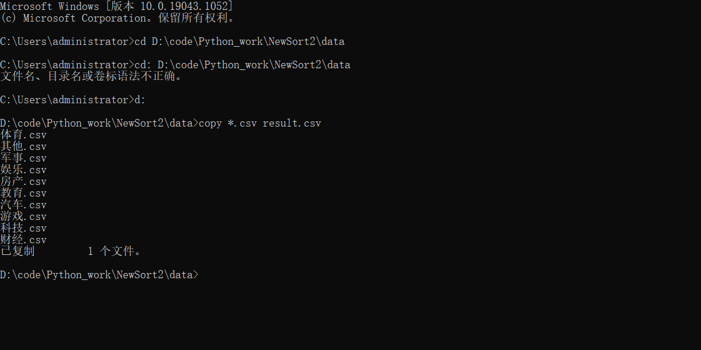
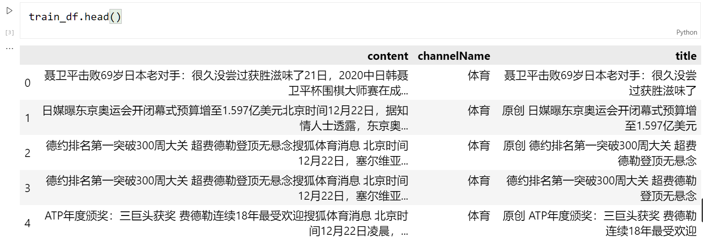
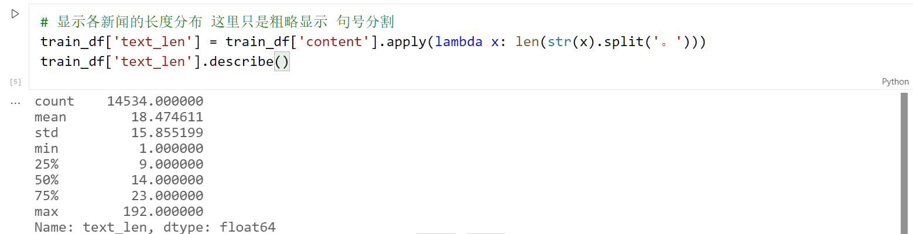
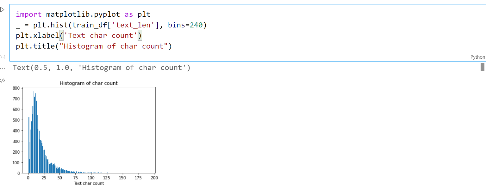
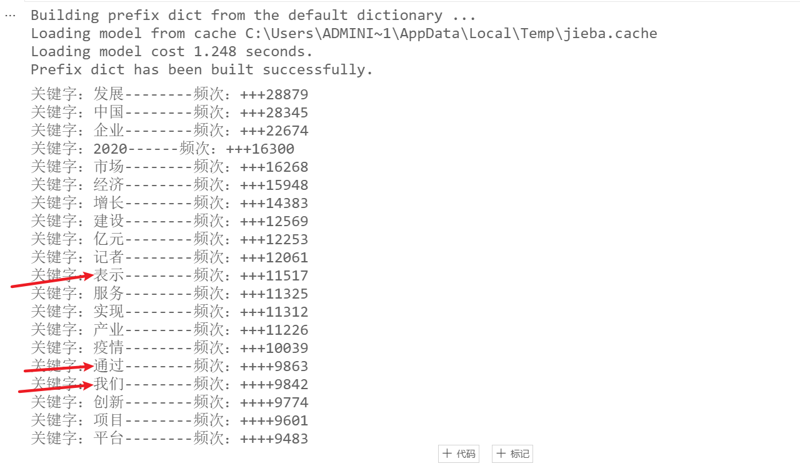

一个很粗糙的新闻文本分类项目，小学期四天写完应付检查的……

后续会进一步改进，包括：

- 丰富训练集的数据，避免军事类、房产类、体育类的新闻数据过少，影响精度
- 改用上限更高的Bert模型
- 优化exe文件的页面，使其能够分别处理识别短文本和excel文件


```文件结构图```

- code
  - -pycache-                         ---pyinstaller 打包生成的文件
  - build                                 ---pyinstaller 打包生成的文件
  - dist                                   ---pyinstaller 打包生成的文件（内有 软件test2.exe 可运行）
  - showTest.ipynb              ---展示测试集处理的脚本
  - showTrain.ipynb            ---展示训练集处理的脚本
  - test.py                              ---测试所用的py文件 可跳过
  - test2.py                            ---项目最终源代码
  - test2.spec                        ---pyinstaller 打包生成的文件
- data
  - hit_stopwords.txt           ---哈工大停词表
  - test_set.csv                      ---处理好的测试集数据
  - train_set.csv                    ---处理好的训练集数据
  - type.xlsx                          ---原测试集数据的类别sheet
- image                                      ---项目的部分运行结果截图
- rootData                                 ---数据清洗前的源数据
- RemdMe.md                          ---项目文件说明

```运行dist目录下的test2.exe即可运行程序```

```选择文件dist/data/type.xlsx 点击确认 即可运行将预测结果写入 至type.xlsx```


### 查看源数据




 		可以明显地看出：

- 源数据（训练）包括新闻标题 内容 和新闻的类别    --- 以下称为  根训练集
- 测试集 包括 测试的编号 新闻标题 新闻内容              --- 以下称为 type.xlsx
- ```需要将预测的结果写入channelName这一列中```

​		为了方便我们进行清洗数据 训练

​		将跟训练集的所有sheet（共九个 其他栏为空）导出为csv 并合并为 train_root.csv

​			具体过程如下：

#### 导出		

```excel
Sub Test() 
    Dim Sht As Worksheet 
    For Each Sht In Sheets 
        Sht.Copy 
        ActiveWorkbook.SaveAs ThisWorkbook.Path & "\" & Sht.Name & ".xlsx" 
        ActiveWorkbook.Close 
    Next 
End Sub
```




#### 合并

- cmd命令行 切换到 所在的目录
- ```copy *.csv train_copy.csv```



#### 输出测试

```python
import pandas as pd
train_df = pd . read_csv ( '../rootData/train_copy.csv' )
train_df.head()
```



#### 统计

```python
# 显示各新闻的长度分布 这里只是粗略显示 句号分割
train_df['text_len'] = train_df['content'].apply(lambda x: len(str(x).split('。')))
train_df['text_len'].describe()
```




```python
# 统计文本长度 生成直方图
import matplotlib.pyplot as plt
_ = plt.hist(train_df['text_len'], bins=240)
plt.xlabel('Text char count')
plt.title("Histogram of char count")
```




### 数据可视分析 清洗处理

#### 词频统计



#### 加载停用词

```python
with open("../data/hit_stopwords.txt", 'r', encoding='utf-8') as f:
    remove_words = [w.strip('\n') for w in f.readlines()]

for word in seg_list_exact: # 循环读出每个分词
    if word not in remove_words: # 如果不在去除词库中
        object_list.append(word) # 分词追加到列表

```


#### 生成词云

-  检查无用词 说明清洗有效


#### 写入

- 将清洗好的数据写入到 train_set.csv中 作为机器学习的训练集     --- 下称为训练集

```python
import csv

header = ['label', 'text']
with open('../rootData/train_set.csv', 'w', encoding="utf-8", newline='') as f: # 解决空行的问题
    writer = csv.writer(f)
    writer.writerow(header)
    writer.writerows(Endlist)
f.close()
```


### 训练

- 简单读取 验证训练集的内容
- 训练模型

```python
# Count Vectors + RidgeClassifier
# 词袋 + 特征值提取
import pandas as pd

from sklearn.feature_extraction.text import CountVectorizer
from sklearn.linear_model import RidgeClassifier
from sklearn.metrics import f1_score

train_df = pd.read_csv('../data/train_set.csv',encoding='ANSI')

vectorizer = CountVectorizer(max_features=3000)
train_test = vectorizer.fit_transform(train_df['text'].values.astype('U'))

clf = RidgeClassifier()
clf.fit(train_test[:10000], train_df['label'].values[:10000])

val_pred = clf.predict(train_test[10000:])

print(f1_score(train_df['label'].values[10000:], val_pred, average='macro'))
print(type(val_pred))

# 0.10343472451465849
# 0.10357460616527975 
# 一定要打乱训练的顺序
# 0.8491012463815872
# 0.8207100395680607
# 0.9201683620360309
```


### 预测结果

- 对预测集进行和训练集一样的处理
- 调用模型 得到pre_val （预测结果 类型为list）
- 写入 type.xlsx中即可

